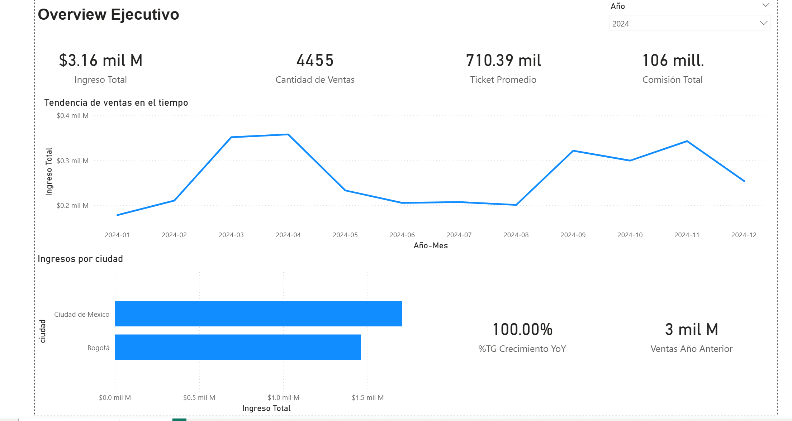
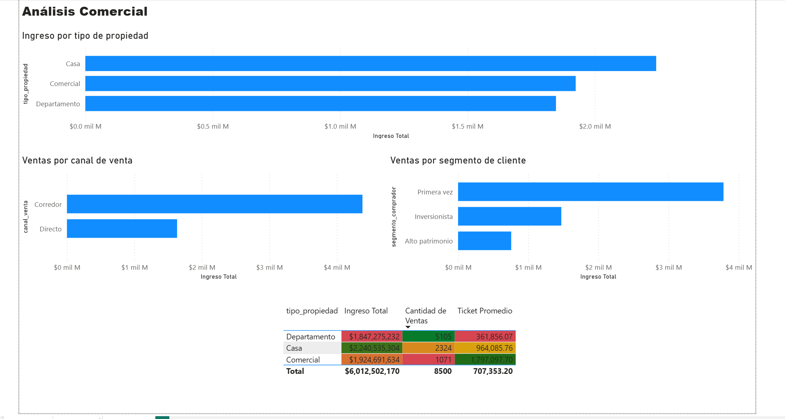
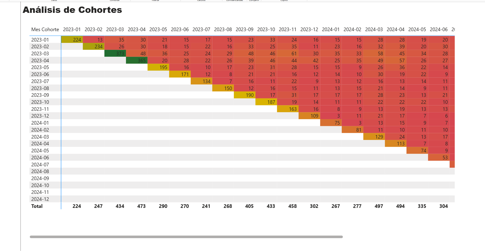

# Desempeño comercial inmobiliario con Power BI

**Mario Alberto Vivero Sahagún | Power BI · DAX · Modelado de datos**

Dashboard ejecutivo de tres páginas sobre 8,500 ventas de propiedades en dos años (2023–2024): desempeño general, análisis comercial por tipo de propiedad, canal y segmento de cliente, y análisis de cohortes de recompra.

## Pregunta de negocio

¿Qué tipos de propiedad, canales y segmentos de clientes generan más ingresos, y los clientes vuelven a comprar después de su primera compra?

## Hallazgos clave

| Indicador | Valor |
|---|---:|
| Ingreso total | $6,012,502,170 |
| Cantidad de ventas | 8,500 |
| Ticket promedio | $707,353 |

| Tipo de propiedad | Ingreso total | % del ingreso | Ventas | Ticket promedio |
|---|---:|---:|---:|---:|
| Casa | $2,240,535,304 | 37.3% | 2,324 | $964,086 |
| Comercial | $1,924,691,634 | 32.0% | 1,071 | $1,797,098 |
| Departamento | $1,847,275,232 | 30.7% | 5,105 | $361,856 |

- **Casa genera más ingresos, pero por poco.** Supera a Comercial por unos 5 puntos porcentuales del total.
- **Cada tipo juega un papel distinto:** Departamento concentra el 60% de las ventas con el ticket más bajo, y Comercial tiene el ticket más alto (cerca de 1.8 millones) con solo el 12.6% de las ventas.
- **El canal Corredor genera la mayor parte del ingreso** (aproximadamente 4.4 mil millones, frente a 1.6 mil millones del canal Directo, según el gráfico del dashboard).
- **El segmento Primera vez aporta más ingresos** que Inversionista y Alto patrimonio.
- **En 2024 el ingreso fue de $3.16 mil millones con 4,455 ventas y un ticket de $710 mil.** Ciudad de México supera a Bogotá en ingresos ese año.
- **Cohortes:** las cohortes más grandes por primeras compras son 2023-03 (373) y 2023-04 (365). Las compras posteriores a la primera son pequeñas frente al tamaño de cada cohorte: por ejemplo, la cohorte 2023-01 tuvo 224 primeras compras y entre 13 y 35 compras por mes en los meses siguientes.

## Recomendaciones

1. **No priorizar solo por ingreso total.** Casa lidera por una diferencia pequeña, mientras que Departamento aporta volumen y Comercial aporta ticket. Antes de decidir dónde enfocar la comercialización, comparar comisión y tiempo de cierre por tipo de propiedad.
2. **Revisar la dependencia del canal Corredor.** Concentra la mayor parte del ingreso; conviene comparar su comisión con la del canal Directo para saber cuánto cuesta ese volumen.
3. **Medir la recompra por clientes únicos.** La matriz de cohortes cuenta ventas, no clientes. Para diseñar acciones de retención hace falta una tasa de recompra por cliente y por cohorte.

## Dashboard

**Overview ejecutivo** (filtrado a 2024)

**Análisis comercial**

**Análisis de cohortes**

## Datos y modelo

Modelo en esquema estrella con relaciones uno a muchos y filtro de dirección simple:

| Tabla | Contenido |
|---|---|
| `hecho_ventas_propiedades` | Transacciones: precio, cliente, propiedad, canal y fecha |
| `dim_clientes` | Clientes y segmento de comprador |
| `dim_propiedades` | Tipo, tamaño y ubicación de la propiedad |
| `dim_fecha` | Tabla calendario creada en Power BI con DAX |

El reporte incluye las medidas Ingreso Total, Cantidad de Ventas, Ticket Promedio y Comisión Total, y para las cohortes se calculan en la tabla de hechos la primera compra por cliente, el mes de cohorte y el mes de venta.

## Limitaciones

- Proyecto académico presentado como caso de negocio; no corresponde a un encargo para una empresa inmobiliaria real.
- Los importes no tienen moneda confirmada.
- Este repositorio incluye capturas del dashboard; no incluye el archivo `.pbix` ni un reporte publicado, por lo que las medidas DAX y las relaciones no se pueden revisar.
- La matriz de cohortes cuenta ventas, no clientes únicos, por lo que no equivale a una tasa de recompra.
- El indicador de crecimiento interanual (YoY) del Overview debe revisarse antes de usarse como conclusión.
